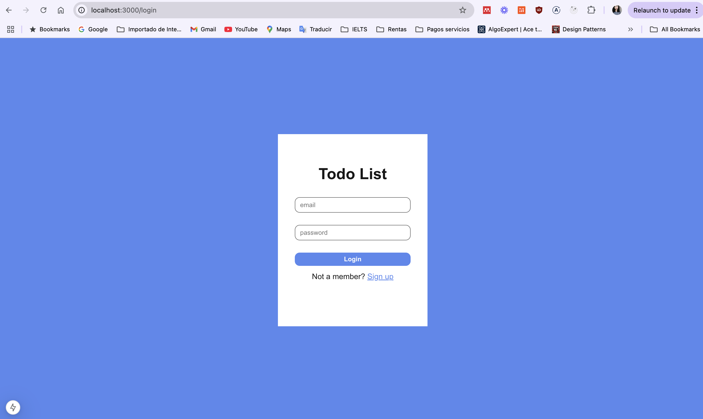

# Prueba técnica - Claroshop

Crear una SPA donde el usuario cuente con una interfaz que le facilite la creación, edición, eliminación y visualización de sus tareas pendientes.

Stack a utilizar: MongoDB | Express | React.js | Next.js | Node.js

## Installation

1. Clonar repositorio

```bash
  git clone https://github.com/SaraiRojas/todo-list-app-CS.git
  cd todo-list-app-CS
```

2. Instalar dependencias

    Ya que el proyecto esta constituido por dos directorios independientes ```todo-list-api``` y ```todo-list-app``` es necesario ir a la raiz de cada directorio e instalar dependencias.

```bash
  cd todo-list-api
  npm i
```

```bash
  cd todo-list-app
  npm i
```

3. Correr el proyecto

    Para correr el proyecto existen dos maneras.

    Primera: Correr cada proyecto respectivamente

```bash
  cd todo-list-api
  npm run dev
```

```bash
  cd todo-list-app
  npm run dev
```

  Segunda: Correr el proyecto desde la raíz. Si no corre desde la raiz, hay que instalar dependencias del directorio raíz.


```bash
  cd ..
  npm i
  npm run dev
```

## Uso

El punto de entrada de la aplicación del lado del servidor se encunetra en:

[http://localhost:8000](http://localhost:8000)

El punto de entrada de la aplicación del lado del cliente se encunetra en:

[http://localhost:3000/login](http://localhost:3000/login)



La aplicación pide iniciar de sesión o crear una cuenta. Puede ingresar un correo falso.

Para probar la aplicación sin crear una cuenta puede utilizar las siguientes credenciales.

```bash
correo: userTest16@mail.com 
contraseña: 1234usertest
```

## Comentarios

Por cuestión de tiempo del lado del cliente solo se implementó las siguientes funcionalidades:
 1. Login y Signup sin autorización solo autentificación
 2. Creación de tareas solo con título y sub-tareas
 3. Renderizado de todas las tareas del usuario con opción de visualizar las tareas completadas o pendientes
 4. Marcar como completada o pendiente cada tarea
 5. Eliminar tareas

 Del lado del servidor esta implementado todos los endpoints para el CRUD de las tareas. A diferencia del cliente, en el lado del servidor si se implemento tanto la autentificación como autorización de usuarios a traves de un token que se guarda en las cookies. La autorización de los usuarios no se implemento en el cliente ya que, si bien el token se guardaba exitosamente en las cookies de Postman, no pasaba lo mismo para el navegador y con el tiempo corriendo decidí el workaround de mandar el id del usuario en las peticiones que lo necesitaban para hacer la consulta en la base de datos.

 Por último, me hubiera gustado poder implementar toda la aplicación en Nextjs para aprovechar toda la capacidad de esté framework. Con más tiempo, me hubiera gustado hacer:
 
 - mejor manejo de errores, utilizando un Error Boundary del lado del cliente y custom exceptions del lado del servidor.
 - mejor forma de manejar los estados en los componentes de react, porque se que como esta implementado se re-renderiza más de lo necesario.
 - solucionar el problema del token que no se guarda en las cookies del navegador.
 - crear endpoints más especificos para el CRUD de subtareas


 ## Contacto

 [LinkedIn](https://www.linkedin.com/in/sarai-rojas-sandoval/)

